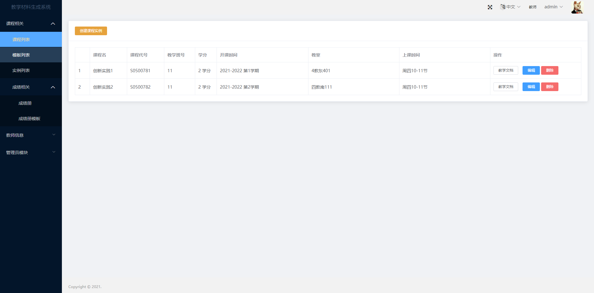
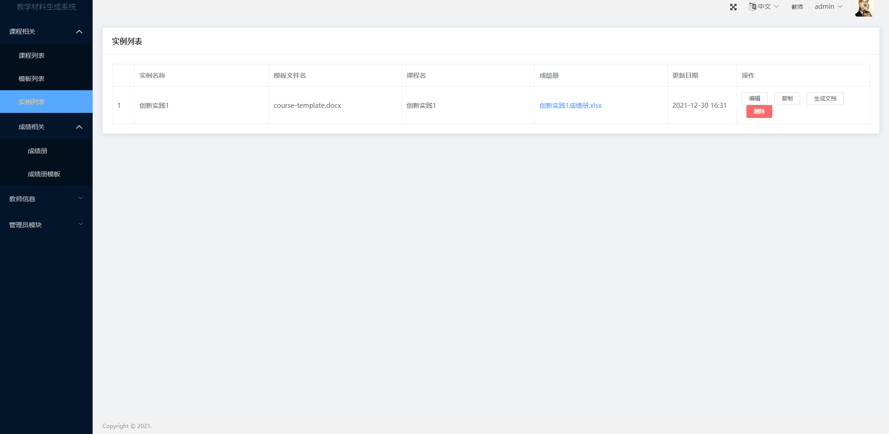
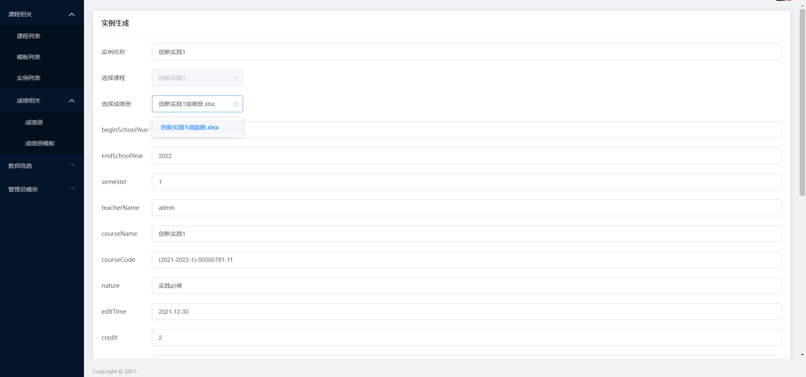
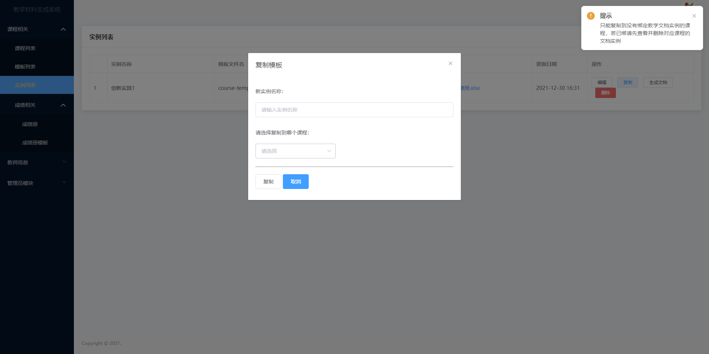
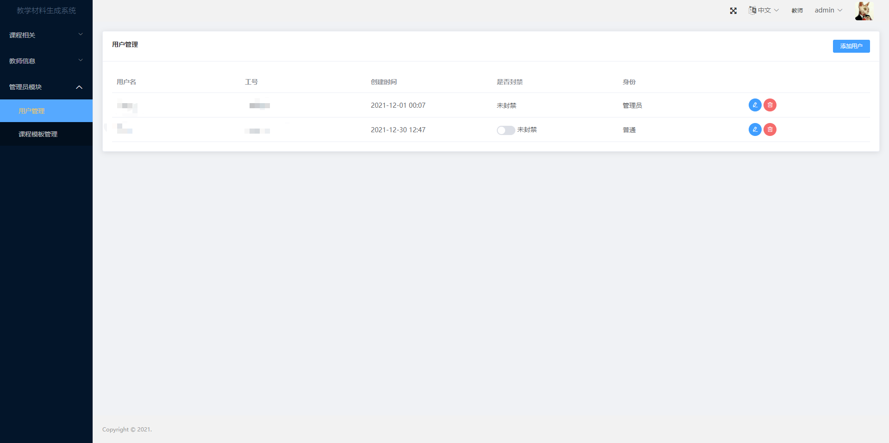
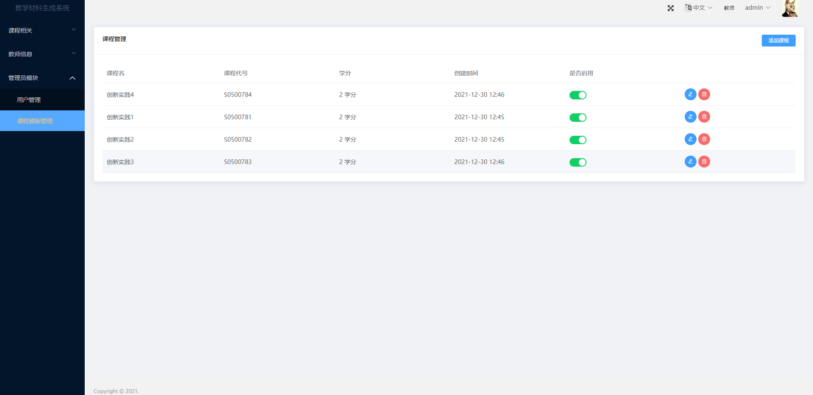

# 教学材料生成系统

> 基于 ElementUI +  Vue2 的教学材料生成系统前端

> Cloudflare 部署

## 📷 Screenshot
|  |  |  |
|:---:|:---:|:---:|
| 课程实例 | 模板实例 | 编辑实例 |

|  |  |  |
|:---:|:---:|:---:|
| 复制实例 | 用户管理 | 课程管理 |

## 功能需求
### 1.1 教师模块
- 基本的登录和鉴权功能
- 修改密码
- 信息保存（工号，姓名）起来，用来绑定到文档模板实例，从而不用在文档中重复输入教师信息
### 1.2 课程模板模块
- 抽离一些通用的东西，如课程名，课程代号等
- 管理员才能创建课程模板
- 课程模板是共享的
### 1.3 课程实例模块
- 通过对课程模板创建多个课程实例，可以解决一个老师同时管理20级创1，19级创3课程实例，一旦下次要创建一个21级创1，20级创1能够完好保存下来
- 课程实例的增删改
- 课程实例主要保存一些每个学期会变化的数据，如：教室地点，教学班号，上课时间，开课时间
### 1.4 文档模板模块
- 模板的上传，从而实现多模板可选
- 模板的保存与下载
### 1.5 文档实例模块
- 可通过模板创建多个实例
- 实例可绑定教师信息，课程实例信息，以及一些通用的信息，从而不再需要重复输入数据
- 实例可以进行复制到其他课程，从而减少重复数据的输入
- 实例可自由增删改
- 实例可绑定成绩册，一旦绑定，生成文档时，下载的即是两者的合并版
### 1.6 成绩册模块
- 模板的上传（管理员），从而实现多模板可选
- 解析上传的excel成绩册，并通过模板渲染出实例，可下载
- 实例要实时保存
- 成绩册可和文档实例绑定
- 不同老师的成绩册实例相互独立，模板共享
